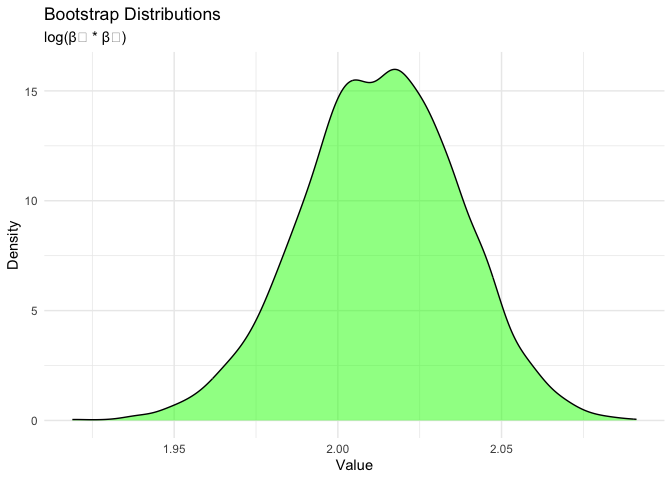
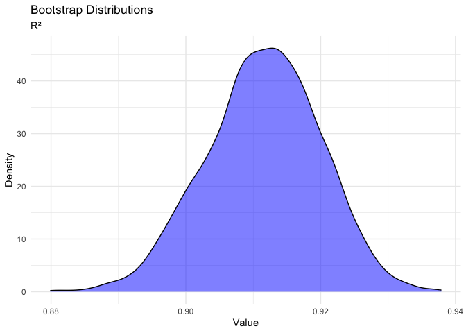
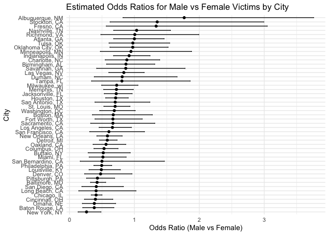
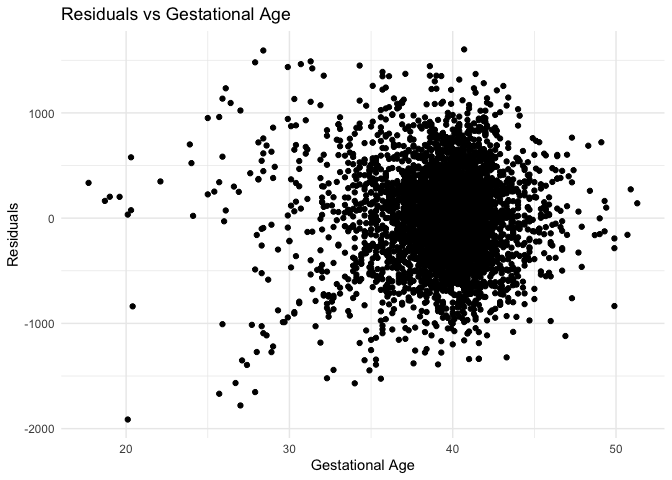
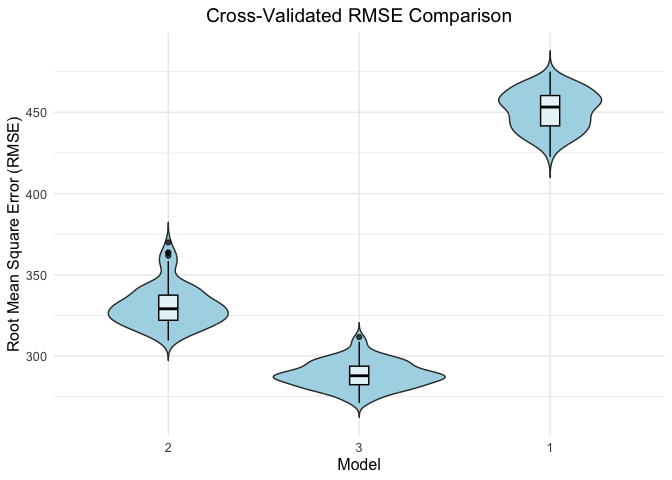

p8105_hw6_kx2224
================
Kangyu Xu (kx2224)
2024-12-02

``` r
library(tidyverse)
```

    ## ── Attaching core tidyverse packages ──────────────────────── tidyverse 2.0.0 ──
    ## ✔ dplyr     1.1.4     ✔ readr     2.1.5
    ## ✔ forcats   1.0.0     ✔ stringr   1.5.1
    ## ✔ ggplot2   3.5.1     ✔ tibble    3.2.1
    ## ✔ lubridate 1.9.3     ✔ tidyr     1.3.1
    ## ✔ purrr     1.0.2     
    ## ── Conflicts ────────────────────────────────────────── tidyverse_conflicts() ──
    ## ✖ dplyr::filter() masks stats::filter()
    ## ✖ dplyr::lag()    masks stats::lag()
    ## ℹ Use the conflicted package (<http://conflicted.r-lib.org/>) to force all conflicts to become errors

``` r
library(modelr)
library(p8105.datasets)
library(mgcv)
```

    ## Loading required package: nlme
    ## 
    ## Attaching package: 'nlme'
    ## 
    ## The following object is masked from 'package:dplyr':
    ## 
    ##     collapse
    ## 
    ## This is mgcv 1.9-1. For overview type 'help("mgcv-package")'.

``` r
library(dplyr)
library(ggplot2)
```

## Problem 1

``` r
weather_df = 
  rnoaa::meteo_pull_monitors(
    c("USW00094728"),
    var = c("PRCP", "TMIN", "TMAX"), 
    date_min = "2017-01-01",
    date_max = "2017-12-31") %>%
  mutate(
    name = recode(id, USW00094728 = "CentralPark_NY"),
    tmin = tmin / 10,
    tmax = tmax / 10) %>%
  select(name, id, everything())
```

    ## using cached file: /Users/kanyeast/Library/Caches/org.R-project.R/R/rnoaa/noaa_ghcnd/USW00094728.dly

    ## date created (size, mb): 2024-12-02 18:16:04.985059 (8.667)

    ## file min/max dates: 1869-01-01 / 2024-11-30

``` r
head(weather_df)
```

    ## # A tibble: 6 × 6
    ##   name           id          date        prcp  tmax  tmin
    ##   <chr>          <chr>       <date>     <dbl> <dbl> <dbl>
    ## 1 CentralPark_NY USW00094728 2017-01-01     0   8.9   4.4
    ## 2 CentralPark_NY USW00094728 2017-01-02    53   5     2.8
    ## 3 CentralPark_NY USW00094728 2017-01-03   147   6.1   3.9
    ## 4 CentralPark_NY USW00094728 2017-01-04     0  11.1   1.1
    ## 5 CentralPark_NY USW00094728 2017-01-05     0   1.1  -2.7
    ## 6 CentralPark_NY USW00094728 2017-01-06    13   0.6  -3.8

``` r
# Define a function to compute bootstrap estimates
bootstrap_estimates <- function(data, n_bootstrap = 5000) {
  set.seed(123) # For reproducibility
  
  bootstrap_results <- replicate(n_bootstrap, {
    # Sample data with replacement
    boot_sample <- data %>% sample_frac(replace = TRUE)
    
    # Fit a linear model
    model <- lm(tmax ~ tmin, data = boot_sample)
    
    # Extract r-squared and log(beta0 * beta1)
    r_squared <- summary(model)$r.squared  # 手动计算 R²
    model_coefs <- broom::tidy(model)
    log_beta0_beta1 <- log(abs(model_coefs$estimate[1] * model_coefs$estimate[2]))
    
    # Return estimates
    c(r_squared = r_squared, log_beta0_beta1 = log_beta0_beta1)
  })
  
  # Convert results to a data frame
  results_df <- as.data.frame(t(bootstrap_results))
  colnames(results_df) <- c("r_squared", "log_beta0_beta1")
  return(results_df)
}

# Perform bootstrap analysis on the provided data
bootstrap_results <- bootstrap_estimates(weather_df)

# Plot the distributions
ggplot(bootstrap_results, aes(x = log_beta0_beta1)) +
  geom_density(fill = "green", alpha = 0.5) +
  labs(title = "Bootstrap Distributions", subtitle = "log(β₀ * β₁)", x = "Value", y = "Density") +
  theme_minimal()
```

<!-- -->

``` r
ggplot(bootstrap_results, aes(x = r_squared)) +
  geom_density(fill = "blue", alpha = 0.5) +
  labs(title = "Bootstrap Distributions", subtitle = "R²", x = "Value", y = "Density") +
  theme_minimal()
```

<!-- -->

``` r
# Compute 95% confidence intervals
ci_r_squared <- quantile(bootstrap_results$r_squared, c(0.025, 0.975))
ci_log_beta0_beta1 <- quantile(bootstrap_results$log_beta0_beta1, c(0.025, 0.975))

# Print confidence intervals
cat("95% Confidence Interval for R-squared:\n")
```

    ## 95% Confidence Interval for R-squared:

``` r
print(ci_r_squared)
```

    ##      2.5%     97.5% 
    ## 0.8945701 0.9271042

``` r
cat("\n95% Confidence Interval for log(beta0 * beta1):\n")
```

    ## 
    ## 95% Confidence Interval for log(beta0 * beta1):

``` r
print(ci_log_beta0_beta1)
```

    ##     2.5%    97.5% 
    ## 1.964166 2.058364

### Bootstrap Results

The calculated 95% CI of **R²** ：

\[0.895, 0.927\]

The calculated 95% CI of **log(β₀ \* β₁)** ：

\[1.964, 2.058\]

## Problem 2

``` r
homicide_df <- read_csv("https://raw.githubusercontent.com/washingtonpost/data-homicides/master/homicide-data.csv") 
```

    ## Rows: 52179 Columns: 12
    ## ── Column specification ────────────────────────────────────────────────────────
    ## Delimiter: ","
    ## chr (9): uid, victim_last, victim_first, victim_race, victim_age, victim_sex...
    ## dbl (3): reported_date, lat, lon
    ## 
    ## ℹ Use `spec()` to retrieve the full column specification for this data.
    ## ℹ Specify the column types or set `show_col_types = FALSE` to quiet this message.

``` r
homicide_df = homicide_df |>
  mutate(city_state = paste(city, state, sep = ", "),
         status = if_else(disposition == "Closed by arrest", 1, 0)
           ) |>  
  filter(
    !city_state %in% c("Dallas, TX", "Phoenix, AZ", "Kansas City, MO", "Tulsa, AL"),
    victim_race %in% c("White", "Black"),
    victim_age != "Unknown") |>
  mutate(victim_age = as.numeric(victim_age)) |>
  select(-city, - state, -disposition)
```

``` r
head(homicide_df)
```

    ## # A tibble: 6 × 11
    ##   uid   reported_date victim_last victim_first victim_race victim_age victim_sex
    ##   <chr>         <dbl> <chr>       <chr>        <chr>            <dbl> <chr>     
    ## 1 Alb-…      20100601 SATTERFIELD VIVIANA      White               15 Female    
    ## 2 Alb-…      20100102 MULA        VIVIAN       White               72 Female    
    ## 3 Alb-…      20100126 BOOK        GERALDINE    White               91 Female    
    ## 4 Alb-…      20100130 MARTIN-LEY… GUSTAVO      White               56 Male      
    ## 5 Alb-…      20100308 GRAY        STEFANIA     White               43 Female    
    ## 6 Alb-…      20100323 DAVID       LARRY        White               52 Male      
    ## # ℹ 4 more variables: lat <dbl>, lon <dbl>, city_state <chr>, status <dbl>

### Logistic Regression for Baltimore

``` r
baltimore_data <- homicide_df %>% filter(city_state == "Baltimore, MD")

baltimore_glm <- glm(status ~ victim_age + victim_sex + victim_race, 
                     data = baltimore_data, family = "binomial")

baltimore_summary <- broom::tidy(baltimore_glm, conf.int = TRUE)
print(baltimore_summary)
```

    ## # A tibble: 4 × 7
    ##   term             estimate std.error statistic  p.value conf.low conf.high
    ##   <chr>               <dbl>     <dbl>     <dbl>    <dbl>    <dbl>     <dbl>
    ## 1 (Intercept)       0.310     0.171        1.81 7.04e- 2  -0.0245  0.648   
    ## 2 victim_age       -0.00673   0.00332     -2.02 4.30e- 2  -0.0133 -0.000246
    ## 3 victim_sexMale   -0.854     0.138       -6.18 6.26e-10  -1.13   -0.584   
    ## 4 victim_raceWhite  0.842     0.175        4.82 1.45e- 6   0.501   1.19

### Logistic Regression for All Cities

``` r
# Fit logistic regression models for each city
city_results <- homicide_df %>%
  group_by(city_state) %>%
  nest() %>%
  mutate(glm_model = map(data, ~ glm(status ~ victim_age + victim_sex + victim_race, 
                                     data = ., family = "binomial")),
         glm_tidy = map(glm_model, ~ broom::tidy(., conf.int = TRUE))) %>%
  select(city_state, glm_tidy) %>%
  unnest(cols = glm_tidy)
```

    ## Warning: There were 44 warnings in `mutate()`.
    ## The first warning was:
    ## ℹ In argument: `glm_tidy = map(glm_model, ~broom::tidy(., conf.int = TRUE))`.
    ## ℹ In group 1: `city_state = "Albuquerque, NM"`.
    ## Caused by warning:
    ## ! glm.fit: fitted probabilities numerically 0 or 1 occurred
    ## ℹ Run `dplyr::last_dplyr_warnings()` to see the 43 remaining warnings.

``` r
odds_ratios <- city_results %>%
  filter(term == "victim_sexMale") %>%
  mutate(OR = exp(estimate),
         lower_CI = exp(conf.low),
         upper_CI = exp(conf.high)) %>%
  select(city_state, OR, lower_CI, upper_CI)

print(odds_ratios)
```

    ## # A tibble: 47 × 4
    ## # Groups:   city_state [47]
    ##    city_state         OR lower_CI upper_CI
    ##    <chr>           <dbl>    <dbl>    <dbl>
    ##  1 Albuquerque, NM 1.77     0.825    3.76 
    ##  2 Atlanta, GA     1.00     0.680    1.46 
    ##  3 Baltimore, MD   0.426    0.324    0.558
    ##  4 Baton Rouge, LA 0.381    0.204    0.684
    ##  5 Birmingham, AL  0.870    0.571    1.31 
    ##  6 Boston, MA      0.674    0.353    1.28 
    ##  7 Buffalo, NY     0.521    0.288    0.936
    ##  8 Charlotte, NC   0.884    0.551    1.39 
    ##  9 Chicago, IL     0.410    0.336    0.501
    ## 10 Cincinnati, OH  0.400    0.231    0.667
    ## # ℹ 37 more rows

``` r
# Plot odds ratios and confidence intervals by city
ggplot(odds_ratios, aes(x = reorder(city_state, OR), y = OR)) +
  geom_point() +
  geom_errorbar(aes(ymin = lower_CI, ymax = upper_CI), width = 0.2) +
  coord_flip() +
  labs(
    title = "Estimated Odds Ratios for Male vs Female Victims by City",
    x = "City",
    y = "Odds Ratio (Male vs Female)"
  ) +
  theme_minimal()
```

<!-- -->

## Problem 3

``` r
bw_df = read_csv("https://p8105.com/data/birthweight.csv") |>
  mutate(
      babysex = recode_factor(babysex, `1` = "Male", `2` = "Female"), 
      frace = recode_factor(frace, `1` = "White", `2` = "Black", `3` = "Asian", 
                                   `4` = "Puerto Rican", `8` = "Other", `9` = "Unknown"),
      mrace = recode_factor(mrace, `1` = "White", `2` = "Black", `3` = "Asian", 
                                   `4` = "Puerto Rican", `8` = "Other"), 
      malform = recode_factor(malform, `0` = "Absent", `1` = "Present"), 
  )%>%
  drop_na()
```

    ## Rows: 4342 Columns: 20
    ## ── Column specification ────────────────────────────────────────────────────────
    ## Delimiter: ","
    ## dbl (20): babysex, bhead, blength, bwt, delwt, fincome, frace, gaweeks, malf...
    ## 
    ## ℹ Use `spec()` to retrieve the full column specification for this data.
    ## ℹ Specify the column types or set `show_col_types = FALSE` to quiet this message.

``` r
sapply(bw_df, function(x) sum(is.na(x)))
```

    ##  babysex    bhead  blength      bwt    delwt  fincome    frace  gaweeks 
    ##        0        0        0        0        0        0        0        0 
    ##  malform menarche  mheight   momage    mrace   parity  pnumlbw  pnumsga 
    ##        0        0        0        0        0        0        0        0 
    ##    ppbmi     ppwt   smoken   wtgain 
    ##        0        0        0        0

### First model regression

``` r
fit_hypothetical <- gam(bwt ~ s(ppwt) + s(gaweeks), data = bw_df)
```

``` r
bw_df <- bw_df %>%
  add_predictions(fit_hypothetical) %>%
  add_residuals(fit_hypothetical)

bw_df %>%
  ggplot(aes(x = gaweeks, y = resid)) +
  geom_point() +
  labs(
    x = "Gestational Age",
    y = "Residuals",
    title = "Residuals vs Gestational Age"
  ) +
  theme_minimal()
```

<!-- -->
\### Cross Validation

``` r
set.seed(123)

# Create cross-validation dataset
cv_df <- crossv_mc(bw_df, 100) %>%
  mutate(
    train = map(train, as_tibble),  # Convert training sets to tibbles
    test = map(test, as_tibble)    # Convert testing sets to tibbles
  )

# Fit models for cross-validation
cv_results <- cv_df %>%
  mutate(
    # Model 1: Hypothetical model using GAM
    model_1 = map(train, ~ gam(bwt ~ s(ppwt) + s(gaweeks), data = .x)),
    # Model 2: Simple linear model
    model_2 = map(train, ~ lm(bwt ~ blength + gaweeks, data = .x)),
    # Model 3: Linear model with interaction terms
    model_3 = map(train, ~ lm(bwt ~ bhead * blength * babysex, data = .x))
  ) %>%
  mutate(
    # Calculate RMSE for each model on the test set
    rmse_model_2 = map2_dbl(model_2, test, ~ rmse(model = .x, data = .y)),
    rmse_model_3 = map2_dbl(model_3, test, ~ rmse(model = .x, data = .y)),
    rmse_model_1 = map2_dbl(model_1, test, ~ rmse(model = .x, data = .y))
  )
```

``` r
# Reshape and visualize RMSE comparison
cv_results %>%
  select(starts_with("rmse")) %>%
  pivot_longer(
    cols = everything(),
    names_to = "model",
    values_to = "rmse",
    names_prefix = "rmse_model_"
  ) %>%
  mutate(model = fct_inorder(model)) %>%
  ggplot(aes(x = model, y = rmse)) +
  geom_violin(trim = FALSE, fill = "lightblue") +  # Add violin plot
  geom_boxplot(width = 0.1, color = "black", alpha = 0.7) +  # Add boxplot
  labs(
    title = "Cross-Validated RMSE Comparison",
    x = "Model",
    y = "Root Mean Square Error (RMSE)"
  ) +
  theme_minimal() +
  theme(
    text = element_text(size = 12),
    plot.title = element_text(hjust = 0.5)  # Center-align the title
  )
```

<!-- -->
